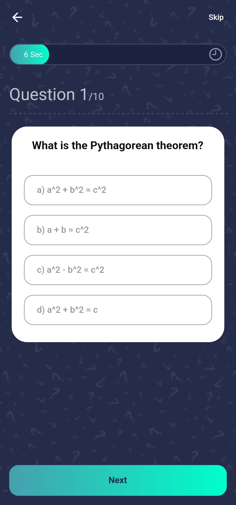
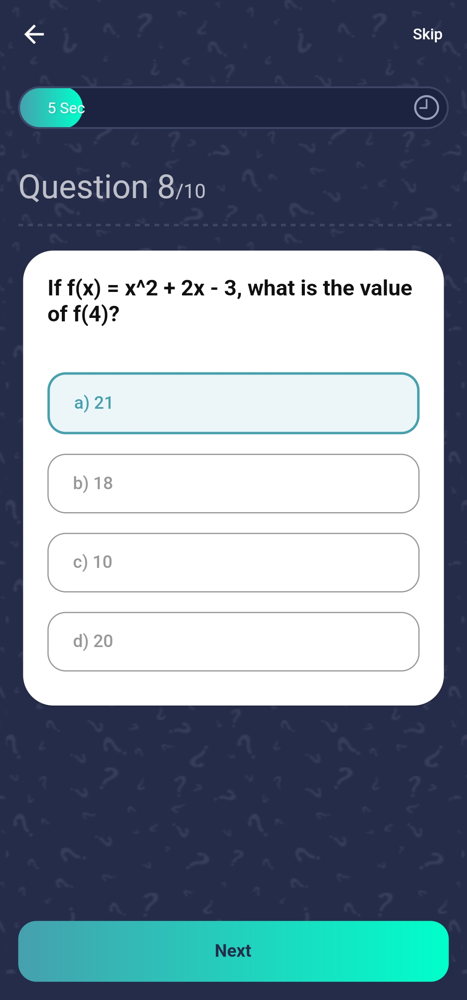

# MathGenius - Quiz App
MathGenius is a simple mathematical quiz app built using Flutter. The app uses Bloc library for state management, which ensures smooth and efficient state management. The Bloc pattern also allows for separation of concerns, making the app easy to maintain and extend.

## Screenshots
    

## Technologies Used
- Flutter
- Bloc

## Contributions
Contributions are welcome! If you find any bugs or have any feature requests, feel free to open an issue or submit a pull request.
